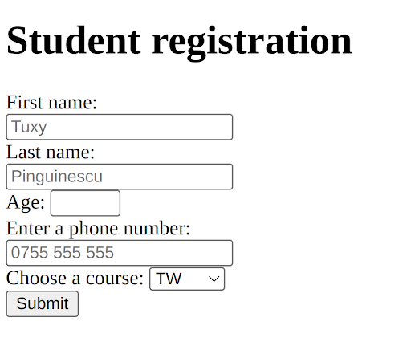
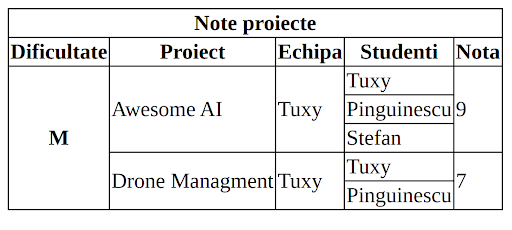
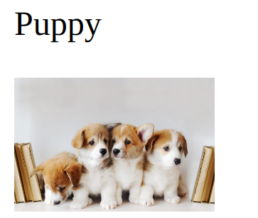

[Prezentare Laboratoar](prezentare_01.pdf)

### Informatii Utile

Tools:

* [JSFiddle](https://jsfiddle.net/)
* [VisualStudioCode](https://code.visualstudio.com/)

Documentatie:

* [W3schools HTML](https://www.w3schools.com/html/)
* [MDN Web Docs HTML](https://developer.mozilla.org/en-US/docs/Web/HTML)
* [HTML5 Element Index](http://html5doctor.com/element-index)
* [Dive Into HTML5](http://diveinto.html5doctor.com/table-of-contents.html#introduction)
* [Awesome HTML](https://github.com/diegocard/awesome-html5#readme)
* [The History of the URL: Path, Fragment, Query, and Auth](https://eager.io/blog/the-history-of-the-url-path-fragment-query-auth/)
* [Validator HTML](https://validator.w3.org)

Exercitii de antrenament:

* [W3school Exercises](https://www.w3schools.com/html/exercise.asp)

### Exercitii

Replicati urmatoarele imagini folosing HTML

#### 1. Formular

[Rezolvare](https://jsfiddle.net/matei10/p3kytb80/8/)
```html
<html>

  <head>

  </head>

  <body>
    <h1>Student registratios</h1>
    <form>
      <label for="firstNAme">First name:</label><br>
      <input type="text" id="firstNAme" name="firstNAme" placeholder="Tuxy"><br>
      <label for="lastName">Last name:</label><br>
      <input type="text" id="lastName" name="lastName" placeholder="Pinguinescu"><br>
      <label for="age">Age:</label>
      <input type="number" id="age" name="age" min="18" max="27"><br>
      <label for="phone">Enter a phone number:</label><br>
      <input type="tel" id="phone" name="phone" placeholder="0755 555 555" pattern="[0-9]{4} [0-9]{3} [0-9]{3}"><br>
      <label for="Course">Choose a course:</label>
      <select id="courses" name="courses">
        <option value="TW">TW</option>
        <option value="BD">BD</option>
        <option value="SGBD">SGBD</option>
        <option value="IP">IP</option>
      </select><br>
      <input type="submit" value="Submit">

    </form>
  </body>

</html>
```

#### 2. Tabel

Puteti adauga urmatoare bucata de CSS la inceputul pagini

```css
<style>
  table,
  th,
  td {
    border: 1px solid black;
    border-collapse: collapse;
  }

</style>

```

[Rezolvare](https://jsfiddle.net/matei10/c5s6xay0/17/)
```html
<html>

  <head>
    <style>
      table,
      th,
      td {
        border: 1px solid black;
        border-collapse: collapse;
      }

    </style>
  </head>

  <body>
    <table>
      <tr>
        <th colspan="5">Note proiecte</th>

      </tr>
      <tr>
        <th > Dificultate </th>
        <th> Proiect </th>
        <th> Echipa </th>
        <th> Studenti </th>
        <th> Nota </th>
      </tr>
      <tr>
        <th rowspan="5">M</th>
        <td rowspan="3">Awesome AI</td>
        <td rowspan="3">Tuxy</td>
        <td>Tuxy</td>
        <td rowspan="3">9</td>
      </tr>
      <tr>
        <td>Pinguinescu</td>
      </tr>
      <tr>
        <td>Stefan</td>
      </tr>

      <tr>
        <td rowspan="2">Drone Managment</td>
        <td rowspan="2">Tuxy</td>
        <td>Tuxy</td>
        <td rowspan="2">7</td>
      </tr>
      <tr>
        <td>Pinguinescu</td>
      </tr>
    </table>
  </body>

</html>
```

#### 3. Puppy

[Rezolvare]()

