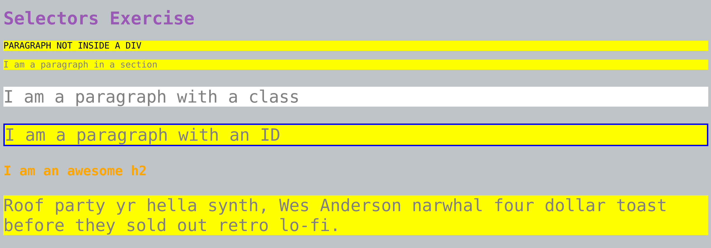
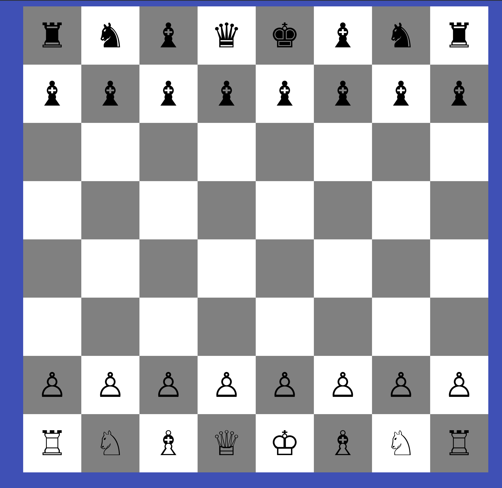
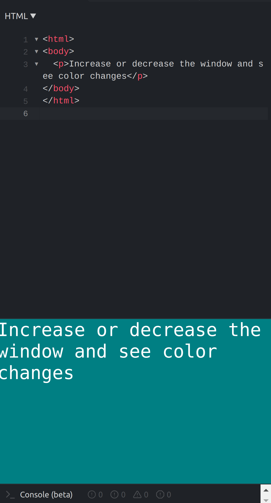
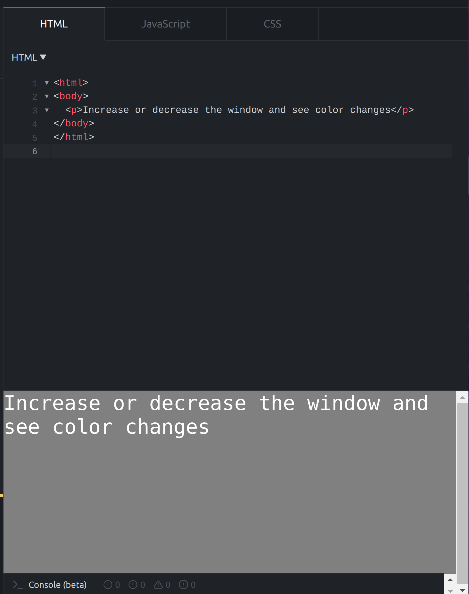
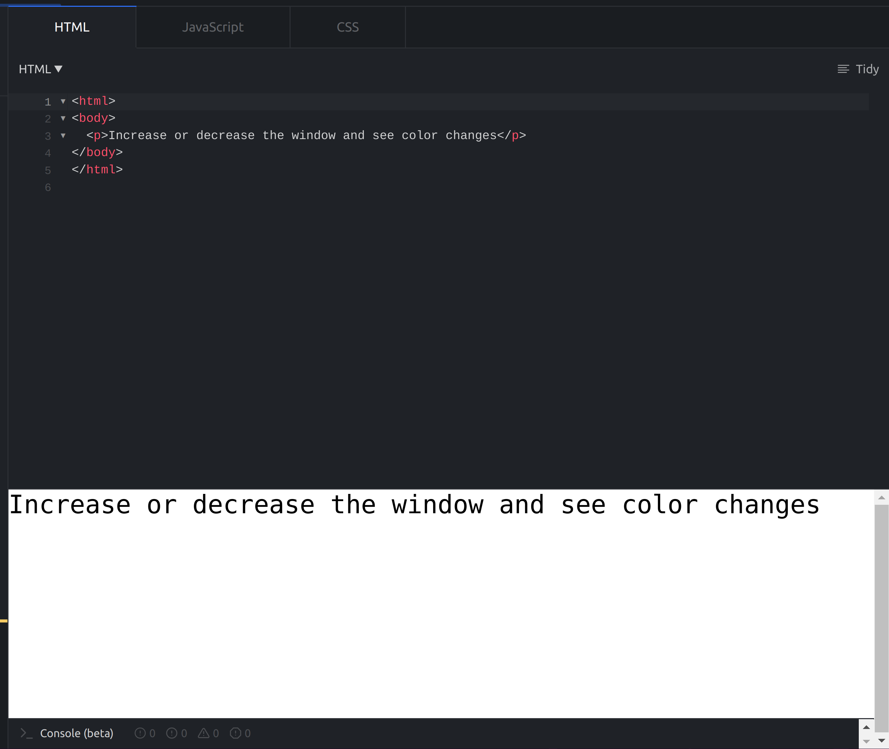
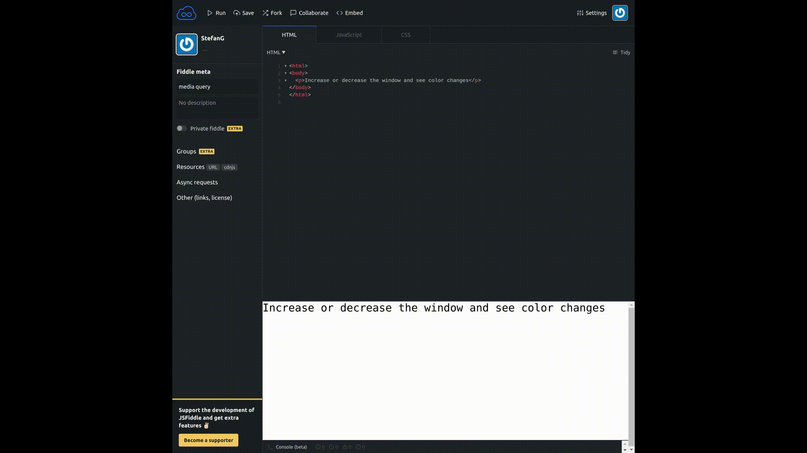

[Laboratoar CSS](https://profs.info.uaic.ro/~busaco/teach/labs/css/)

[Prezentarea Curs si informatii utile](https://profs.info.uaic.ro/~busaco/teach/courses/web/web-film.html#week2)

### Informatii Utile

Tools:

* [JSFiddle](https://jsfiddle.net/)
* [VisualStudioCode](https://code.visualstudio.com/)
* [HTML Validator](https://validator.w3.org/)
* [CSS Validator](https://jigsaw.w3.org/css-validator/)

Documentatie:

* [W3schools CSS](https://www.w3schools.com/css/)
* [MDN Web Docs CSS](https://developer.mozilla.org/en-US/docs/Web/CSS)
* [CSS Cheat Sheet](https://adam-marsden.co.uk/css-cheat-sheet)
* [7 Important Tips for Writing Better CSS](https://www.freecodecamp.org/news/7-important-tips-for-writing-better-css/)
* [CSS Zen Garden](http://www.csszengarden.com/)
* [CSS @ DevDocs](https://devdocs.io/css/)

Exercitii de antrenament:

* [CSS Exercitii](https://www.w3schools.com/css/exercise.asp)
* [CSS Diner](https://flukeout.github.io/)

### Exercitii

Replicati urmatoarele imagini folosing HTML si CSS

#### 1. BoxModel

[Rezolvare](https://jsfiddle.net/StefanG/f25a76z9/)

#### 2. Selectia elementelor

[Rezolvare](https://jsfiddle.net/StefanG/4fvLyd9p/)

#### 3. Sah
Aici puteti tabele sau div-uri pentru rezolvare

[Rezolvare folosind tabele](https://jsfiddle.net/StefanG/Lrywe3vo/)

[Rezolvare folosind div](https://jsfiddle.net/StefanG/3609rpvc/)

#### 4. Design Responsive

Dimensiuni ecran:

* `360`
* `480`
* `760`

[Rezolvare]()

